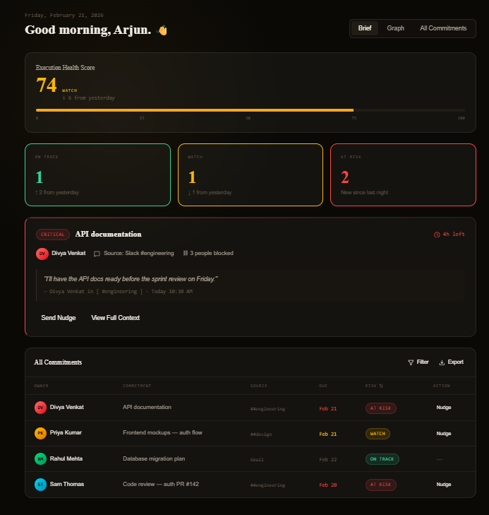

<p align="center">
  
  &nbsp;
  
  &nbsp;
  
  &nbsp;
  
  &nbsp;
  
</p>

<br/>

<h1 align="center">
  <br/>
  SENTINEL
  <br/>
  <sub><sup>Execution Intelligence Platform</sup></sub>
</h1>

<p align="center">
  <strong>Your team makes promises in Slack and Gmail every day. Most of them disappear.</strong><br/>
  Sentinel automatically extracts every delivery commitment, scores its risk of slipping, and alerts the right owner — before the deadline is missed.
</p>

<p align="center">
  <a href="#-demo"><strong>Watch Demo</strong></a> &nbsp;·&nbsp;
  <a href="#-quick-start"><strong>Quick Start</strong></a> &nbsp;·&nbsp;
  <a href="#-key-features"><strong>Features</strong></a> &nbsp;·&nbsp;
  <a href="#-technology-stack"><strong>Tech Stack</strong></a> &nbsp;·&nbsp;
  <a href="#%EF%B8%8F-architecture"><strong>Architecture</strong></a>
</p>

<br/>

---

## 🎬 Demo

> **Watch Sentinel in action — commitment extraction, risk scoring, and smart alerts.**


<p align="center">
  <video src="docs/assets/SENTINEL.mp4" controls width="100%" style="border-radius:12px; max-width:900px;">
    Your browser does not support the video tag.
    <a href="docs/assets/SENTINEL.mp4">Click here to download and watch the demo video.</a>
  </video>
</p>

---

## 🖼️ Screenshots

<table>
  <tr>
    <td align="center" width="50%">
      
      <br/>
      <strong>📊 Dashboard — Execution Health Score</strong>
      <br/>
      <sub>Real-time health score · High-risk commitments · Live metrics</sub>
    </td>
    <td align="center" width="50%">
      
      <br/>
      <strong>🔗 Integrations — OAuth Connection Hub</strong>
      <br/>
      <sub>One-click connect · Slack · Gmail · GitHub · Jira · Calendar</sub>
    </td>
  </tr>
  <tr>
    <td align="center" width="50%">
      
      <br/>
      <strong>📋 Commitments — Full Tracking List</strong>
      <br/>
      <sub>Owner · Due date · Risk badge · Source channel · Nudge action</sub>
    </td>
    <td align="center" width="50%">
      
      <br/>
      <strong>🕸 Dependency Graph — Live Blocker Map</strong>
      <br/>
      <sub>Interactive node graph · Risk-colored owners · Zoom + pan</sub>
    </td>
  </tr>
</table>

---

## ✨ Key Features

| Feature | Description |
|:--------|:------------|
| 🔍 **Passive Commitment Extraction** | Silently reads Slack channels and Gmail threads — extracts every promise with owner, due date, and confidence score. Zero input from the team. |
| 📊 **4-Factor Risk Scoring** | Every commitment scored 0–100 based on deadline proximity, dependency chain, owner silence, and current workload. Updated every 6 hours. |
| 🔔 **Smart Owner Alerts** | When risk crosses threshold, the owner — not the manager — receives a Slack DM with two options: *"I'm On It"* or *"Draft Update"* (AI writes it). |
| 🕸 **Dependency Graph** | Full-page interactive network visualization. Nodes = team members. Edges = commitments. Red = at risk. Click any node for full commitment list. |
| 🌅 **Morning Brief** | Daily situational awareness digest — surfaces critical updates, risks, and blocked teammates before the workday starts. |
| 🧊 **Glass Command Dashboard** | Ultra-premium interface with real-time Execution Health Score (0–100) for leadership — one glance, full picture. |
| 🔗 **Multi-Platform Integrations** | Slack · Gmail · GitHub · Jira · Notion · Linear · Google Calendar · Microsoft Teams |

---

## 🛠️ Technology Stack

### Frontend
<p>
  
  
  
  
  
</p>

| Package | Version | Purpose |
|:--------|:--------|:--------|
| React | 19 | UI Framework |
| Vite | 6 | Build Tool |
| TypeScript | 5.8 | Type Safety |
| Tailwind CSS | 4 | Styling |
| Framer Motion | 12 | Animations |
| TanStack Query | 5 | Data Fetching & Caching |

### Backend
<p>
  
  
  
  
  
</p>

| Package | Version | Purpose |
|:--------|:--------|:--------|
| FastAPI | 0.115 | REST API Framework |
| Python | 3.11 | Runtime |
| Uvicorn | Latest | ASGI Server |
| Supabase | 3 | Database + Auth + RLS |
| Groq API | Latest | LLM Inference (Llama 3.3 70B) |
| Google Gemini | 1.5 | Fallback LLM |
| Celery | Latest | Background Task Queue |
| Upstash Redis | Latest | Message Broker |
| python-jose | Latest | JWT Authentication |

### Infrastructure
| Service | Purpose |
|:--------|:--------|
| Vercel | Frontend hosting · Global CDN |
| Render | Backend hosting · Async workers |
| Supabase Cloud | Managed PostgreSQL · Row-Level Security |
| Upstash | Serverless Redis · Task queue |
| UptimeRobot | Uptime monitoring · Keep-alive |
| 🔥 IBM Cloud AMD MI300X | Enterprise LLM inference (Roadmap) |

---

## 🏗️ Architecture

```
┌─────────────────────────────────────────────────────────┐
│              CLIENT LAYER  (React 19 / Vite / TS)        │
│   Dashboard · Commitments · Graph · Integrations · Auth  │
└──────────────────────────┬──────────────────────────────┘
                           │  HTTPS / REST API
┌──────────────────────────▼──────────────────────────────┐
│          API & AUTH LAYER  (FastAPI + JWT)                │
│  /auth  /dashboard  /commitments  /webhooks  /cron       │
│         OAuth 2.0: Slack · Gmail · GitHub                │
└──────────┬───────────────────────────┬───────────────────┘
           │                           │
┌──────────▼──────────┐   ┌───────────▼────────────────────┐
│    DATA LAYER        │   │      AI PROCESSING ENGINE       │
│  Supabase            │   │  Groq LPU · Llama 3.3 70B       │
│  PostgreSQL + RLS    │   │  Risk Engine · LLM Client       │
│  5 core tables       │   │  → AMD Instinct MI300X roadmap  │
└─────────────────────┘   └────────────────┬────────────────┘
                                           │
┌──────────────────────────────────────────▼────────────────┐
│               EXTERNAL INTEGRATIONS                        │
│    Slack API  ·  Gmail API  ·  GitHub OAuth  ·  Jira       │
└────────────────────────────────────────────────────────────┘
```

### AI Pipeline — How a Commitment is Extracted

```
Slack Message / Gmail
       │
       ▼
Webhook / Polling Capture  ──  FastAPI endpoint
       │
       ▼
Preprocessing  ──  De-duplicate · Enrich metadata
       │
       ▼
Groq LPU (Llama 3.3 70B)  ──  Returns structured JSON:
       │                       { commitment, owner_email,
       │                         due_date, confidence,
       │                         source_channel }
       ▼
Risk Engine  ──  Score 0–100
       │         (deadline · dependencies · silence · workload)
       ▼
Supabase  ──  Store with RLS
       │
       ▼
Dashboard + Alerts  ──  Owner notified if score > threshold
```

---

## 🚀 Quick Start

### Prerequisites

| Requirement | Version |
|:------------|:--------|
| Node.js | v18+ |
| Python | 3.10+ |
| npm or yarn | Latest |
| pip | Latest |

### 1. Clone the Repository

```bash
git clone https://github.com/your-org/sentinel.git
cd sentinel
```

### 2. Frontend Setup

```bash
# Navigate to frontend
cd SENTINEL-Frontend

# Install dependencies
npm install

# Configure environment
cp .env.example .env
# Add your API keys to .env

# Start development server
npm run dev
```

> Frontend runs at `http://localhost:3000`

### 3. Backend Setup

```bash
# Navigate to backend
cd SENTINEL-Backend

# Create and activate virtual environment
python -m venv venv

# Windows
venv\Scripts\activate

# Mac / Linux
source venv/bin/activate

# Install dependencies
pip install -r requirements.txt

# Configure environment
cp .env.example .env
# Add your credentials to .env

# Start development server
uvicorn app.main:app --reload
```

> Backend API runs at `http://localhost:8000`
> Interactive API docs at `http://localhost:8000/docs`

---

## ⚙️ Environment Variables

### Frontend — `SENTINEL-Frontend/.env`

| Variable | Description | Required |
|:---------|:------------|:--------:|
| `VITE_API_URL` | Backend API base URL | ✅ |
| `VITE_GEMINI_API_KEY` | Gemini API key for AI features | ✅ |

### Backend — `SENTINEL-Backend/.env`

| Variable | Description | Required |
|:---------|:------------|:--------:|
| `SUPABASE_URL` | Supabase project URL | ✅ |
| `SUPABASE_KEY` | Supabase service role key | ✅ |
| `GEMINI_API_KEY` | Google Gemini API key | ✅ |
| `GROQ_API_KEY` | Groq API key (Llama 3.3 70B) | ✅ |
| `JWT_SECRET` | Secret for JWT token signing | ✅ |
| `GOOGLE_CLIENT_ID` | Google OAuth client ID | ✅ |
| `GOOGLE_CLIENT_SECRET` | Google OAuth client secret | ✅ |
| `GITHUB_CLIENT_ID` | GitHub OAuth client ID | ✅ |
| `GITHUB_CLIENT_SECRET` | GitHub OAuth client secret | ✅ |
| `SLACK_CLIENT_ID` | Slack OAuth client ID | ✅ |
| `SLACK_CLIENT_SECRET` | Slack OAuth client secret | ✅ |
| `REDIS_URL` | Upstash Redis connection URL | ✅ |

---

## 📁 Project Structure

```
SENTINEL/
├── SENTINEL-Frontend/              # React + Vite frontend
│   ├── src/
│   │   ├── components/             # Reusable UI components
│   │   ├── pages/                  # Page-level components
│   │   │   ├── Dashboard.tsx       # Execution Health Score
│   │   │   ├── Commitments.tsx     # Full commitment list
│   │   │   ├── Graph.tsx           # Dependency graph
│   │   │   └── Integrations.tsx    # OAuth connection cards
│   │   ├── context/                # React context providers
│   │   ├── hooks/                  # Custom React hooks
│   │   └── lib/                    # Utilities & helpers
│   └── index.html
│
├── SENTINEL-Backend/               # FastAPI backend
│   ├── app/
│   │   ├── api/                    # API route handlers
│   │   │   ├── auth.py             # JWT auth endpoints
│   │   │   ├── dashboard.py        # Metrics aggregation
│   │   │   ├── commitments.py      # Commitment CRUD
│   │   │   ├── webhooks.py         # Slack event ingestion
│   │   │   └── cron.py             # Risk re-scoring jobs
│   │   ├── services/               # Business logic
│   │   │   ├── extractor.py        # LLM commitment extraction
│   │   │   └── risk_engine.py      # Risk scoring algorithm
│   │   ├── models/                 # Pydantic data models
│   │   ├── integrations/           # External API clients
│   │   │   ├── slack.py
│   │   │   ├── gmail.py
│   │   │   └── github.py
│   │   └── db/                     # Supabase utilities
│
├── docs/
│   └── assets/                     # Screenshots & demo video
│       ├── SENTINEL.mp4
│       ├── Dashboard.png
│       ├── Commitment Page.png
│       ├── Dependency Graph Page.png
│       └── Integration Page.png
│
└── README.md
```

---

## 🎨 Design Philosophy

Sentinel follows the **Zenith of Beauty** principle — where form meets function with absolute clarity.

- Every interaction is designed to feel physical and immediate
- Every blur is mathematically balanced for readability
- Every animation communicates system status, not decoration
- The Glass Command aesthetic provides depth without distraction

---

## 🗺️ Roadmap

| Phase | Status | Description |
|:------|:------:|:------------|
| Prototype · Free Tiers | ✅ Live | Groq · Supabase · Render · Vercel |
| Gmail OAuth Polling | ✅ Live | gmail.readonly · httpx polling |
| Slack Event Webhooks | ✅ Live | Real-time message ingestion |
| 4-Factor Risk Engine | ✅ Live | Deterministic 0–100 scorer |
| AMD EPYC™ Cloud Deploy | 🔄 Phase 2 | Dedicated VM · 4 vCPU · 8GB |
| AMD Instinct™ MI300X | 🔜 Phase 3 | Self-hosted Llama 3.3 70B via IBM Cloud |
| ROCm™ Inference Stack | 🔜 Phase 3 | VPC-native · Zero data leaves infra |
| Multilingual Extraction | 🔜 Phase 2 | Hindi · Spanish · French · Arabic |
| Microsoft Teams Integration | 🔜 Phase 2 | OAuth + message polling |

---

## 💰 Cost Structure

| Phase | Monthly Cost | Notes |
|:------|:------------:|:------|
| 🟢 Prototype | **₹0** | All free tiers |
| 🟡 Growth (50 seats) | **₹21,385** | Profitable at 50 workspaces × ₹499 |
| 🔴 Enterprise (AMD MI300X) | **₹728–₹1,092/hr** | 4–6× cheaper than cloud API at scale |

*Exchange rate: $1 = ₹91*

---

## 📄 License

This project is licensed under the **MIT License** — see the [LICENSE](LICENSE) file for details.

---

<p align="center">
  Built with ❤️ by <strong>Quantumstacks Lab</strong> · AMD Slingshot Hackathon 2026
  <br/><br/>
  <a href="https://github.com/your-org/sentinel/issues">🐛 Report Bug</a> &nbsp;·&nbsp;
  <a href="https://github.com/your-org/sentinel/discussions">💬 Discussions</a> &nbsp;·&nbsp;
  <a href="https://github.com/your-org/sentinel">⭐ Star this repo</a>
  <br/><br/>
  <sub>Powered by AMD EPYC™ · Roadmap: AMD Instinct™ MI300X + ROCm™ · IBM Cloud</sub>
</p>
